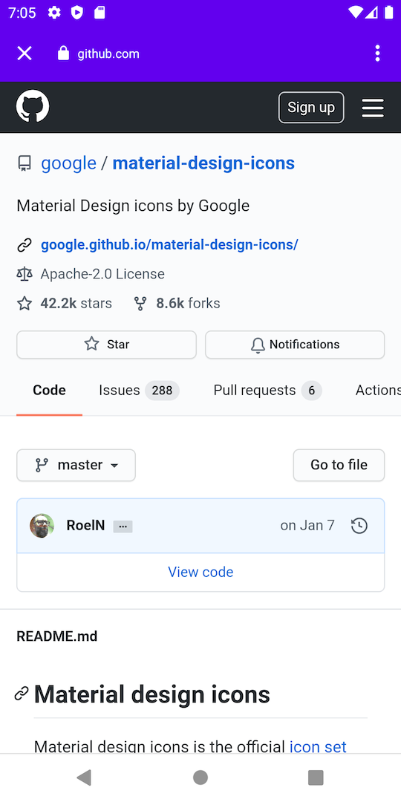
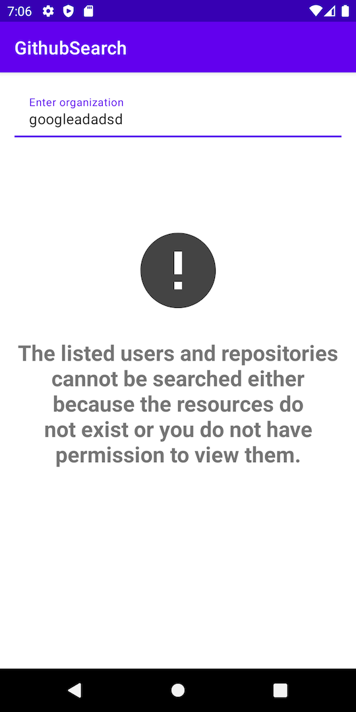

# GithubSearch

## Introduction
A sample application that provides the users with the option to search the top repositories in github for the organization.

## Implementation

### Search by a valid organization
1. The user has the option to enter the name of the organization.
2. On typing the organization name, the app searches for the top repositories.
3. Displays the Top 3 repositories based on the star count.
4. User can tap on a repo in the result list. On tapping, the user will be navigated to the github page for the repo.

### Search by restricted or invalid organization name
1. The user has the option to enter the name of the organization.
2. On typing the organization name, the app searches for the top repositories.
3. If the server returns an error, the error message would be displayed in the screen.

## App Architecture
1. Presentation layer - Android Architecture components - MVVM pattern
2. Domain layer - UseCases based implementation - Exposes a LiveData with the result for the usecase execution
3. Data layer - Repository design pattern - In the current implementation, the repository class depends only on a remote datasource.

## Technologies:
1. Android architecture components
2. RxJava - For asynchronous operations.
3. Retrofit - OKHttp - Gson - For Network operations and communicating with the server
4. Dagger2 - Dependency injection.
5. JUnit, Mockito - For unit testing

## Screenshots:

